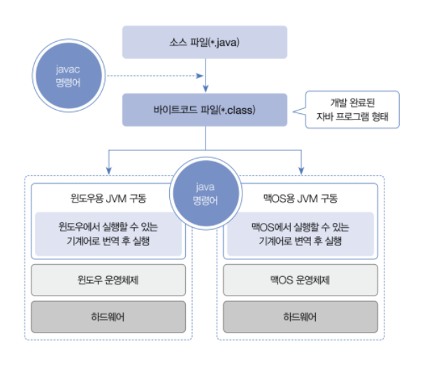

# 자바 시작하기

## 1-1. 프로그래밍 언어와 자바

- 컴퓨터가 이해할 수 있는 기계어(machine language)는 0과 1로 이루어진 이진 코드를 사용한다.
- 사람과 컴퓨터가 대화하기 위해서는 사람의 언어와 기계어의 다리 역할을 하는 프로그래밍 언어가 필요하다.
- 프로그래밍 언어는 고급 언어와 저급 언어로 구분된다.
- 고급 언어로 작성된 소스 파일은 컴퓨터가 바로 이해할 수 없기 때문에 컴파일(compile)이라는 과정을 통해서 컴퓨터가 이해할 수 있는 0과 1로 이루어진 기계어로 변환한 후 컴퓨터가 사용하게 된다.
- 반대로 저급 언어란 기계어에 가까운 언어를 말하는데, 대표적으로 어셈블리어가 저급 언어에 속한다.
- 자바는 1995년도에 처음 썬 마이크로시스템즈(Sun Microsystems)에서 발표한 후, 가장 성공한 프로그래밍 언어로서 전세계적으로 다양한 분야에서 사용되고 있다.
- 안드로이드 폰에서 실행하는 애플리케이션 뿐만 아니라, 웹 사이트를 개발하는 핵심 언어로 사용되고 있다.
- 모든 운영체제에서 실행 가능한 데스크톱 애플리케이션도 개발할 수 있다.
- 자바는 다른 프로그래밍 언어에 비해 다음과 같은 특징이 있다.
  1. 모든 운영체제에서 실행 가능
    - 자바로 작성된 프로그램은 운영체제와 상관없이 모두 실행되기 때문에 윈도우에서 개발된 프로그램을 수정 없이 바로 맥OS 또는 리눅스에서도 실행할 수 있다는 장점이 있다.
  2. 객체 지향 프로그래밍
    - 먼저 객체(부품)를 만들고, 이 객체들을 서로 연결해서 더 큰 프로그램을 완성시키는 기법을 객체 지향 프로그래밍(Object Oriented Programming, OOP)이라고 한다.
    - 자바는 OOP를 위한 최적의 언어이다.
  3. 메모리 자동 정리
    - 자바는 메모리(RAM)를 자동 관리하므로, 개발자는 메모리 관리의 수고스러움을 덜고 핵심 기능 작성에 집중할 수 있다.
  4. 무료 라이브러리 풍부
    - 무료로 다운로드해서 사용할 수 있는 오픈 소스 라이브러리(Open Source Library)가 풍부하기 때문에 프로그램 개발 기간을 단축시켜준다.

## 1-2. 자바 개발 환경 설정

- 내가 사용할 환경은 다음과 같다.
  - 자바는 17버전을 주로 쓰고, 19, 11, 8 버전도 사용해보겠다.
  - amazon corretto 에서 jdk를 다운 받았다.
  - 통합 IDE는 Jetbrains 의 Intellij IDEA Ultimate 버전을 사용한다.

## 1-3. 바이트코드 파일과 자바 가상 머신

- JDK를 설치했다면 이제 자바 언어로 작성한 소스 파일을 만들고 컴파일할 수 있다.
- 자바 소스 파일의 확장명은 `.java`이다.

### 바이트코드 파일

- 소스 파일(`.java`)을 작성한 후에는 컴파일을 해야 한다.
- javac(java compiler) 명령어는 소스 파일을 컴파일하는데, 컴파일 결과는 확장명이 `.class`인 바이트코드(ByteCode) 파일로 생성된다.
- 윈도우, 맥OS, 리눅스 등 어떤 운영체제라 하더라도 동일한 소스 파일을 javac로 컴파일하면 모두 동일한 바이트코드 파일이 생성된다.

### 자바 가상 머신

- 바이트코드 파일(`*.class`)을 특정 운영체제가 이해하는 기계어로 번역하고 실행시키는 명령어는 `java`이다.
- `java`명령어는 JDK와 함께 설치된 자바 가상 머신(Java Virtual Machine, JVM)을 구동시켜 바이트 코드 파일을 완전한 기계어로 번역하고 실행시킨다.
- 바이트코드 파일은 운영체제와 상관없이 모두 동일한 내용으로 생성되지만, 자바 가상 머신은 운영체제에서 이해하는 기계어로 번역해야 하므로 운영체제별로 다르게 설치된다.
- 그래서 운영체제별로 설치하는 JDK가 다른 것이다.



## 1-4. 소스 작성부터 실행까지

> #### 패키지란?
> 
> - 자바는 소스 파일 및 컴파일된 바이트코드 파일을 쉽게 관리하기 위해 패키지(package)를 사용한다.
> - 패키지는 마치 파일 시스템의 디렉토리와 비슷하다.

```java
package ch01.sec06;                             // 바이트코드 파일이 위치할 패키지 선언

public class Hello {                            // Hello 클래스 선언
    public static void main(String[] args) {    // main() 메소드 선언
        System.out.println("Hello, Java");      // 콘솔에 출력하는 코드
    }
}
```

## 1-5. 코드 용어 이해

```java
package ch01.sec06;
```
- 다음과 같은 코드를 패키지 선언이라고 부르며, 이는 소스 파일이 `src/ch01/sec06`패키지에 있다는 뜻이다.
- `public class Hello`를 클래스 선언이라 부르며, `Hello`를 클래스명이라고 한다.
- 클래스명은 숫자로 시작할 수 없고, 공백을 포함해서는 안된다.
- 그리고 소스 파일명과 대소문자가 완전히 일치해야 한다.
- 그 다음으로 나오는 중괄호 { ... }를 클래스 블록이라고 하며, 여기에는 클래스의 정의 내용이 작성된다.
- `public static void main(String[] args) {...}`를 `main()`메소드라고 부른다.
- 그리고 중괄호 `{...}`를 `main()`메소드 블록이라고 한다.
- 바이트코드 파일을 실행하면 이 `main()`메소드 블록이 실행된다.
- 그래서 `main()`메소드를 프로그램 실행 진입점(entry point)이라고 부른다.
- 마지막줄은 괄호 안에 있는 내용을 Console 뷰에 출력하는 코드이다.
```java
System.out.println("Hello, Java");
```

## 1-6. 코드 주석 달기

- 주석은 프로그램 실행과는 상관없이 코드에 설명을 붙인 것이다.
- 복잡한 코드일수록 주석을 달면 전체 코드를 이해하기 쉽다.
- 주석은 컴파일 과정에서 무시되기 때문에 주석을 많이 작성한다고 해서 바이트코드 파일의 크기가 커지는 것은 아니다.

| 구분      | 주석 기호    | 설명                                                                     |
|---------|----------|------------------------------------------------------------------------|
| 행 주석    | // ⋯     | //부터 행 끝까지 주석으로 처리한다.                                                  |
| 범위 주석   | /* ⋯ */  | /*와 */사이에 있는 내용은 모두 주석으로 처리한다.                                         |
| 도큐먼트 주석 | /** ⋯ */ | /**와 */사이에 있는 내용은 모두 주석으로 처리한다.<br>javadoc 명령어로 API 도큐먼트를 생성하는 데 사용한다. |
- 주석 기호는 코드 내 어디서든 작성이 가능하지만, 문자열(" ") 내부에서 작성하면 안 된다.
- 문자열 내부에서 주석 기호는 주석문이 아니라 문자열 데이터로 인식하기 때문이다.
```java
System.out.println("Hello, /*주석이 될 수 없음*/ welcome to the java world!");
```
- 주석문 작성을 연습해보자.
```java
package ch01.sec11;

/**
 * @author jerok-kim
 */
/*
장제목: 1장 자바 시작하기
작성일: 2022.12.19
 */
public class Hello {
    // 프로그램 실행 진입점
    public static void main(String[] args) {
        // 콘솔에 출력하는 실행문
        System.out.println("Hello, Java");
    }
}
```

## 1-7. 실행문과 세미콜론

- `main()`메소드 블록 내부에는 다양한 실행문이 작성된다.
- `System.out.println("Hello, Java");`은 괄호() 안의 내용을 출력하는 실행문이다.
- 실행문은 변수 선언, 변수값 저장, 메소드 호출에 해당하는 코드를 말한다.
```java
int x;                       // 변수 x 선언
x = 1;                       // 변수 x에 1 값을 저장
int y = 2;                   // 변수 y를 선언하고 2 값을 저장
int result = x + y;          // 변수 result를 선언하고 변수 x와 y를 더한 값을 저장
System.out.println(result);  // 콘솔에 변수의 값을 출력하는 println() 메소드 호출
```
- 실행문 끝에는 반드시 세미콜론(;)을 붙여야 한다.
- 실행문을 여러 줄에 걸쳐서 작성하고 맨 마지막에 세미콜론을 붙여도 된다.
- 또한 여러 가지 실행문을 세미콜론으로 구분해서 한 줄로 작성할 수도 있다.
- 실행문에 세미콜론을 붙이는 실습을 해보자.
```java
package ch01.sec12;

public class Calculator {
    public static void main(String[] args) {
        int x = 1;                   // 변수 x를 선언하고 1을 저장
        int y = 2;                   // 변수 y를 선언하고 2를 저장
        int result = x + y;          // 변수 result를 선언하고 x와 y를 더한 값을 저장
        System.out.println(result);  // 콘솔에 출력하는 메소드 호출
    }
}
```

## 연습

### 다음과 같이 출력되도록 `Example.java`를 패키지 `ch01.verify`에서 작성해보자
```text
개발자가 되기 위한 필수 개발 언어 Java
```
```java
package ch01.verify;

public class Example {
    public static void main(String[] args) {
        System.out.println("개발자가 되기 위한 필수 개발 언어 Java");
    }
}
```