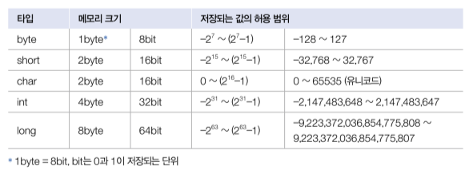
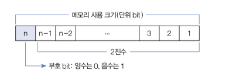
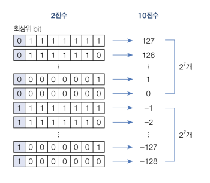
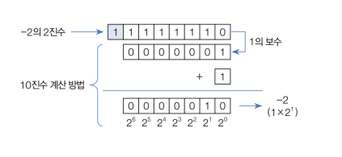
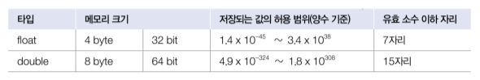
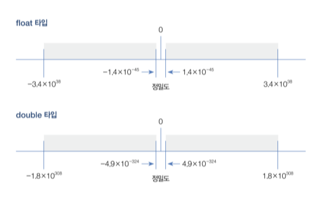
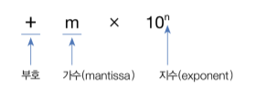
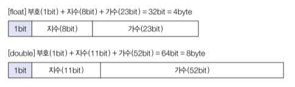

# 변수와 타입

## 2-1. 변수 선언

- 컴퓨터 메모리(RAM)는 수많은 번지들로 구성된 데이터 저장 공간이다.
- 프로그램은 데이터를 메모리에 저장하고 읽는 작업을 빈번히 수행한다.
- 데이터를 어디에, 어떤 방식으로 저장할지 정해져 있지 않다면 메모리 관리가 무척 어려워진다.
- 프로그래밍 언어는 이 문제를 해결하기 위해 변수를 사용한다.
- 변수(variable)는 하나의 값을 저장할 수 있는 메모리 번지에 붙여진 이름이다.
- 변수를 통해 프로그램은 메모리 번지에 값을 저장하고 읽을 수 있다.
- 자바의 변수는 다양한 타입의 값을 저장할 수 없다.
- 즉, 정수형 변수에는 정수값만 저장할 수 있고, 실수형 변수에는 실수값만 저장할 수 있다.
- 변수를 사용하려면 변수 선언이 필요한데, 변수 선언은 어떤 타입의 데이터를 저장할 것인지 그리고 변수 이름이 무엇인지를 결정하는 것이다.
```java
int age;       // 정수(int)값을 저장할 수 있는 age 변수 선언
double value;  // 실수(double) 값을 저장할 수 있는 value 변수 선언
```
- 변수 이름은 첫 번째 글자가 문자여야 하고, 중간부터는 문자, 숫자, $, _를 포함할 수 있다.
- 첫 문자를 소문자로 시작하되 캐멀 스타일로 작성하는 것이 관례이다.

> #### 캐멀(camel) 스타일
> 
> 1. 자바 소스 파일명(클래스명)은 대문자로 시작하는 것이 관례<br>
>   Week.java<br>
>   MemberGrade.java<br>
>   ProductKind.java<br>
> <br>
> 2. 변수명은 소문자로 시작하는 것이 관례
>   score<br>
>   mathScore<br>
>   sportsCar<br>
- 변수가 선언되었다면 값을 저장할 수 있는데, 이때 대입 연산자인 `=`를 사용한다.
- 자바에서는 우측 값을 좌측 변수에 대입하는 연산자로 사용된다.
```java
int score;   // 변수 선언
score = 90;  // 값 대입
```
> #### 변수 이름이 길이와 한글
> 
> - 변수 이름은 어떤 값을 저장하고 있는지 쉽게 알 수 있도록 의미 있는 이름을 지어주는 것이 좋다.
> - 변수 이름의 길이는 프로그램 실행과는 무관하기 때문에 충분히 길어도 상관없다.
> - 변수 이름에 한글을 포함하지 않는 것이 관례이다.
- 변수 선언은 저장되는 값의 타입과 이름만 결정한 것이지, 아직 메모리에 할당된 것은 아니다.
- 변수에 최초로 값이 대입될 때 메모리에 할당되고, 해당 메모리에 값이 저장된다.
- 변수에 최초로 값을 대입하는 행위를 변수 초기화라고 하고, 이때의 값을 초기값이라고 한다.
- 초기 값은 다음과 같이 변수를 선언함과 동시에 대입할 수도 있다.
```java
int score = 90;
```
- 초기화되지 않은 변수는 아직 메모리에 할당되지 않았기 때문에 변수를 통해 메모리 값을 읽을 수 없다.
- 다음은 잘못된 예시이다.
```java
int value;                // 변수 value 선언
int result = value + 10;  // 변수 value 값을 읽고 10을 더해서 변수 result에 저장
```
- 변수 `value`가 선언되었지만, 초기화되지 않았기 때문에 `value + 10`에서 `value`변수값은 읽어올 수 없다.
- 다음 예제는 초기화되지 않은 변수를 연산식에 사용할 경우 컴파일 에러(variable value might not have been initialized)가 발생하는 것을 보여준다.
```java
package ch02.sec01;

public class VariableInitializationExample {
    public static void main(String[] args) {
        // 변수 value 선언
        int value;
        
        // 연산 결과를 변수 result의 초기값으로 대입
        int result = value + 10;
        
        // 변수 result 값을 읽고 콘솔에 출력
        System.out.println(result);
    }
}
```
- 변수는 출력문이나 연산식에 사용되어 변수값을 활용한다.
- 다음 예제는 변수를 문자열과 결합 후 출력하거나 연산식에서 활용하는 모습을 보여준다.
```java
package ch02.sec01;

public class VareiableUseExample {
    public static void main(String[] args) {
        int hour = 3;
        int minute = 5;
        System.out.println(hour + "시간 " + minute + "분");

        int totalMinute = (hour * 60) + minute;
        System.out.println("총 " + totalMinute + "분");
    }
}
```
```text
3시간 5분
총 185분
```
- 변수는 또 다른 변수에 대입되어 메모리 간에 값을 복사할 수 있다.
- 다음 코드는 변수 x값을 변수 y값으로 복사한다.
```java
int x = 10;  // 변수 x에 10을 대입
int y = x;   // 변수 y에 변수 x값을 대입
```
- 다음 예제는 두 변수의 값을 교환하는 방법을 보여준다.
- 두 변수의 값을 교환하기 위해서 새로운 변수 `temp`를 선언한 것에 주목하자.
```java
package ch02.sec01;

public class VariableExchangeExample {
    public static void main(String[] args) {
        int x = 3;
        int y = 5;
        System.out.println("x:" + x + ", y:" + y);

        int temp = x;
        x = y;
        y = temp;
        System.out.println("x:" + x + ", y:" + y);
    }
}
```
```text
x:3, y:5
x:5, y:3
```

## 2-2. 정수 타입

- 변수는 선언될 때의 타입에 따라 저장할 수 있는 값의 종류와 허용 범위가 달라진다.
- 자바는 정수, 실수, 논리값을 저장할 수 있는 기본(primitive) 타입 8개를 다음과 같이 제공한다.

| 값의 분류          | 기본 타입                        |
|----------------|------------------------------|
| 정수             | byte, char, short, int, long |
| 실수             | float, double                |
| 논리(true/false) | boolean                      |

- 정수 타입은 총 5개로, 다음과 같이 메모리 할당 크기와 저장되는 값이 범위를 가지고 있다.



- 각 타입에 저장되는 값의 허용 범위를 모두 외울 필요는 없지만 메모리 할당 크기는 알고 있는 것이 좋다.
- 정수 타입을 메모리 사용 크기순으로 나열하면 다음과 같다.

| 종류                | byte | short | int | long |
|-------------------|------|-------|-----|------|
| 메모리 사용 크기(단위 bit) | 8    | 16    | 32  | 64   |

- 메모리 크기를 n이라고 할 때 정수 타입은 다음과 같은 동일한 구조의 2진수로 저장된다.



- `byte`, `short`, `int`, `long`은 모두 부호 있는(signed) 정수 타입이므로 최상위 bit는 부호 bit로 사용 되고, 나머지 bit는 값이 범위를 결정한다.
- 예를 들어 `byte`타입은 최상위 bit를 부호 비트로 사용하고 나머지 7bit로 값의 범위를 결정한다.



- 최상위 bit가 1인 음수의 경우 나머지 7개의 bit를 모두 1의 보수(1은 0, 0은 1)로 바꾸고 1을 더한 값에 -를 붙이면 10진수가 된다.
- 예를 들어 -2는 다음과 같이 계산된다.



- 코드에서 프로그래머가 직접 입력한 값을 리터럴(literal)이라고 부르는데, 변수에 대입할 정수 리터럴은 진수에 따라 작성하는 방법이 다르다.
#### 2진수: 0b 또는 0B로 시작하고 0과 1로 작성
```java
int x = 0b1011;
int y = 0B10100;
```
#### 8진수: 0으로 시작하고 0~7 숫자로 작성
```java
int x = 013;
int y = 0206;
```
#### 10진수: 소수점이 없는 0~9 숫자로 작성
```java
int x = 12;
int y = 365;
```
#### 16진수: 0x 또는 0X로 시작하고 0~9 숫자나 A, B, C, D, E, F 또는 a, b, c, d, e, f로 작성
```java
int x = 0xB3;
int y = 0X2A0F;
```
- 다음 예제는 다양한 정수 리터럴을 `int`타입 변수에 대입하고 10진수로 출력한다.
```java
package ch02.sec02;

public class IntegerLiteralExample {
    public static void main(String[] args) {
        int var1 = 0b1011;  // 2진수
        int var2 = 0206;    // 8진수
        int var3 = 365;     // 10진수
        int var4 = 0xB3;    // 16진수

        System.out.println("var1: " + var1);
        System.out.println("var2: " + var2);
        System.out.println("var3: " + var3);
        System.out.println("var4: " + var4);
    }
}
```
```text
var1: 11
var2: 134
var3: 365
var4: 179
```
- 다음 예제는 `byte`타입 변수에 허용 범위를 초과한 값을 대입했을 경우 컴파일 오류가 발생하는 것을 보여준다.
```java
package ch02.sec02;

public class ByteExample {
    public static void main(String[] args) {
        byte var1 = -128;
        byte var2 = -30;
        byte var3 = 0;
        byte var4 = 30;
        byte var5 = 127;
        byte var6 = 128;  // 컴파일 에러(incompatible types: possible lossy conversion from int to byte)

        System.out.println(var1);
        System.out.println(var2);
        System.out.println(var3);
        System.out.println(var4);
        System.out.println(var5);
    }
}
```
- `long`타입은 수치가 큰 데이터를 다루는 프로그램에서 사용된다.
- 기본적으로 컴파일러는 정수 리터럴을 `int`타입 값으로 간주하기 때문에, `int`타입의 허용 범위(-2,147,483,648 ~ 2,147,483,647)를 초과하는 리터럴은 뒤에 소문자 'l'이나 대문자 'L'을 붙여 `long`타입 값임을 컴파일러에게 알려줘야 한다.
```java
package ch02.sec02;

public class LongExample {
    public static void main(String[] args) {
        long var1 = 10;
        long var2 = 20L;
        long var3 = 1000000000000;  // 컴파일러는 int로 간주하기 때문에 에러(integer number too large) 발생
        long var4 = 1000000000000L;

        System.out.println(var1);
        System.out.println(var2);
        System.out.println(var4);
    }
}
```

## 2-3. 문자 타입

- 하나의 문자를 작은따옴표(')로 감싼 것을 문자 리터럴이라고 한다.
- 문자 리터럴은 유니코드로 변환되어 저장되는데, 유니코드는 세계 각국의 문자를 0~65535 숫자로 매핑한 국제 표준 규약이다.
- 자바는 이러한 유니코드를 저장할 수 있도록 `char`타입을 제공한다.
```java
char var1 = 'A';    // 'A' 문자와 매핑되는 숫자: 65로 대입
char var3 = '가';    // '가' 문자와 매핑되는 숫자: 44032로 대입
```
- 유니코드가 정수이므로 `char`타입도 정수 타입에 속한다.
- 그렇기 때문에 `char`변수에 작은따옴표로 감싼 문자가 아니라 유니코드 숫자를 직접 대입할 수도 있다.
```java
char c = 65;      // 10진수 65와 매핑되는 문자: 'A'
char c = 0x0041;  // 16진수 0x0041과 매핑되는 문자: 'A'
```
```java
package ch02.sec03;

public class CharExample {
    public static void main(String[] args) {
        char c1 = 'A';     // 문자 저장
        char c2 = 65;      // 유니코드 직접 저장

        char c3 = '가';    // 문자 저장
        char c4 = 44032;   // 유니코드 직접 저장

        System.out.println(c1);
        System.out.println(c2);
        System.out.println(c3);
        System.out.println(c4);
    }
}
```
```text
A
A
가
가
```
- `char`타입의 변수에 어떤 문자도 대입하지 않고 단순히 초기화를 할 목적으로 다음과 같이 작은따옴표(') 두 개를 연달아 붙인 빈(empty) 문자를 대입하면 컴파일 에러가 발생한다.
- 이 경우에는 공백(유니코드:32) 하나를 포함해서 초기화해야 한다.
```java
char c = '';   // 컴파일 에러
char c = ' ';  // 공백 하나를 포함해서 초기화
```

## 2-4. 실수 타입

- 실수 타입에는 `float`과 `double`이 있으며 다음과 같이 메모리 할당 크기와 저장되는 값의 범위를 가지고 있다.



- 그림으로 표현하면 `double`타입이 `float`타입보다 큰 실수를 저장할 수 있고 정밀도 또한 높은 것을 볼 수 있다.



- 자바는 IEEE 754 표준에 근거해서 `float`타입과 `double`타입의 값을 부동 소수점(floating-point) 방식으로 메모리에 저장한다.



- 관련 내용을 여기서도 참고해보자. [실수를 표현하는 자료형](https://jerok-kim.github.io/do_it_c/chapter_03.html#%EC%8B%A4%EC%88%98%EB%A5%BC-%ED%91%9C%ED%98%84%ED%95%98%EB%8A%94-%EC%9E%90%EB%A3%8C%ED%98%95)
- `float`타입과 `double`타입은 가수와 지수를 저장하기 위해 전체 bit를 다음과 같이 나누어 사용한다.



- 최상위 1bit는 양수 및 음수를 결정짓는 부호 bit로 0이면 양수, 1이면 음수가 된다.
- 지수는 `float`타입은 8bit, `double`타입은 11bit로 표현하고 나머지 bit는 모두 가수를 표현하는 데 사용된다.
- `double`은 `float`보다 지수와 가수 부분의 bit수가 크기 때문에 더 크고 정밀한 실수를 저장할 수 있다.
- 코드에서 실수 리터럴은 다음과 같이 작성할 수 있다.

#### 10진수 리터럴

```java
double x = 0.25;
double y = -3.14;
```

#### e 또는 E가 포함된 10의 거듭제곱 리터럴
```java
double x = 5e2;
double y = 0.12E-2
```
- 컴파일러는 실수 리터럴을 기본적으로 `double`타입으로 해석하기 때문에 `double`타입 변수에 대입해야 한다.
- `float`타입에 대입하고 싶다면 리터럴 뒤에 소문자 'f'나 대문자 'F'를 붙여 컴파일러가 `float`타입임을 알 수 있도록 해야 한다.
```java
double var = 3.14;
double var = 314e-2;
```
```java
float var = 3.14f;
float var = 3E6F;
```
- 다음 예제는 `float`과 `double`타입의 소수 이하 유효 자릿수를 확인한다.
- `double`타입은 `float`타입 보다 약 2배의 유효 자릿수를 가지기 때문에 보다 정확한 데이터 저장이 가능하다.
- `double`이라는 이름도 `float`보다 약 2배의 정밀도를 갖는다는 의미에서 붙여진 것이다.
- 10의 거듭 제곱 리터럴을 대입해서 출력해보자.
```java

```

## 2-5. 논리 타입
## 2-6. 문자열 타입
## 2-7. 자동 타입 변환
## 2-8. 강제 타입 변환
## 2-9. 연산식에서 자동 타입 변환
## 2-10. 문자열을 기본 타입으로 변환
## 2-11. 변수 사용 범위
## 2-12. 콘솔로 변수값 출력
## 2-13. 키보드 입력 데이터를 변수에 저장
## 연습